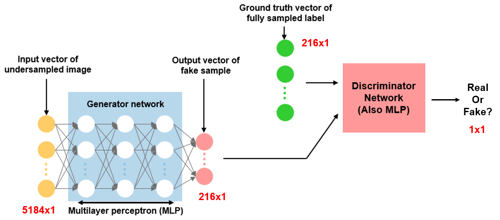

# Subsampling aliasing artifact eliminator
Artificial Intelligence-based Magnetic Resonance Image Reconstruction method using Generative adversarial network

## Abstract
Our method is a parallel MR imaging method using deep learning. Various studies are under way to reduce the scan time of MRI. Undersampling without getting all of the phase encoding lines can save a lot of scan time, but aliasing artifacts occur. We attempted to remove this artifact using neural networks. Although it succeeded in getting some gain with multilayer perceptron, we tried to go further using Generative Adversarial Networks.

## Sample raw data for training dataset
2D T2-weighted brain data for artificial intelligence imaging time acceleration
* Consisting of 5 .mat files
* [# of PE lines] x [# of FE lines] x [# of channels] x [# of slices]  
* Open access: [xairc homepage](https://xai.kaist.ac.kr/research/data/)

## Preprocessed data
* Training dataset consisting of 85 subjects
* Test dataset consisting of 2 subjects
* Open access: [Google drive](https://drive.google.com/open?id=1h1YgjAKPNXajD-0JHwBSMsn58846KKDT)

## Environment
* Python 3.6.6
* Pytorch 0.4.1
* Numpy 1.15.2
* h5py, matplotlib

## Reference
* Kinam Kwon, Dongchan Kim, and HyunWook Park. "A parallel MR imaging method using multilayer perceptron." *Medical physics* 44.12 (2017): 6209-6224. [Link](https://aapm.onlinelibrary.wiley.com/doi/full/10.1002/mp.12600)

## Contributing
_"Thanks for your interest in contributing! There are many ways to contribute to this project. Get started [here](https://github.com/nhjeong/Subsampling_aliasing_artifact_eliminator/blob/master/CONTRIBUTING.md)"_
